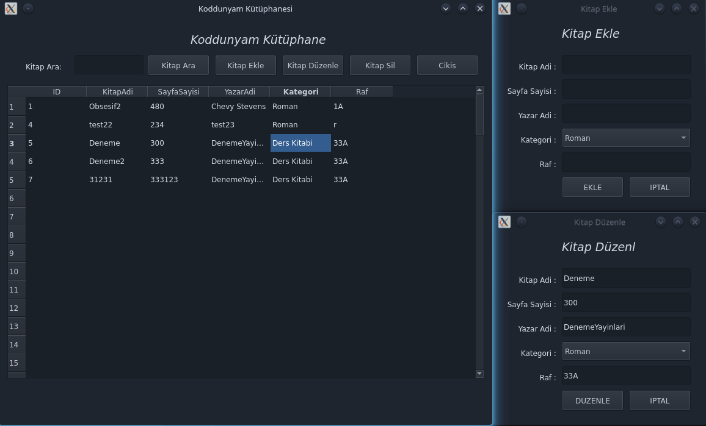

<h1 align="center">SQLite3 Kütüphane Uygulamasi</h1>

<div align="center">
  <strong>SQLite3 ile calisan Kütüphane Arayüzü</strong>
</div>

<br />

<div align="center">
  
  <a href="https://github.com/Saizzou/Koddunyam_Python_Kutuphane/graphs/contributors"></a>
  
  
</div>

<br />

# Yükleme
Yerel veritabani olusacaktir. Yaptiginiz islemler kaybolmaz! 

## Temel Gereksinimler:

1- Python!

2- Vakit

3- SQLite3 (Varsa DB Browser gayet kullanislidir)

4- PyQt5


### Projeyi calistirma ve inceleme:

Projeyi calistirmak icin :
``` python main.py```

Projeyi Youtube de nasil Programladigimizi inceleyebilirsiniz! : 
<a href="https://www.youtube.com/watch?v=xxD0YQYeeWU&t=3s">Koddunyam.net</a>


### Katilimcilar:
SQL Incelemesi icin <a href="https://github.com/MucahitSaratar">Mücahit Saratar</a>'a tesekkür ederim!
